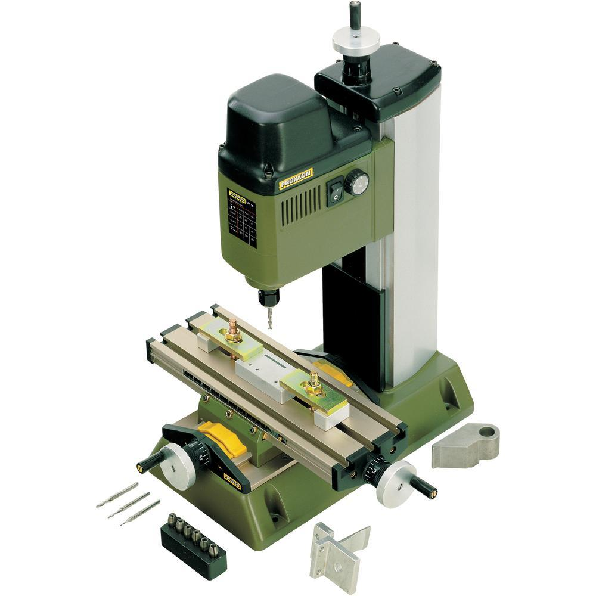

# Manchester HacSpace - Proxon MF70

This is the project page for the Proxxon MF70 Mill that has been adapted into a small scale CNC Mill for use with
PCB Milling.

Originally this device was a manual mill, but stepper drivers have been attached to all the axis to change it into a CNC.

## Outstanding things to look at

  * [Auto Leveling of Z Axis](AutoLeveling.md)
  * [Redo the breakout / control board using a Arm Due](ControlBoard.md)
  * Attach a Rpi3 to the back of the monitor and use this to control the CNC, look into 3D Acceleration and a web browser with webgl for Chillipepr

## Milling Docs

At some point someone may want to incorperate these into the Manchester Hacspace wiki
For now I've included them here as it's easier to copy and paste.

  * [Milling](Milling.md)
